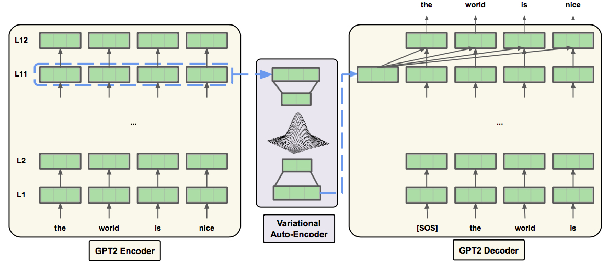

# Exploring latent beliefs dimensions in social media text

This project is inspired by a psychology research on how human view about this world. A person's point of view about the surrounding enviroment might have a great impact on how he/she thinks and acts. For example, people might believe that "the world is interesting and excitiing", or "everything is always against me". Psychologists named these foundation beliefs "primals". 

In this project, we want to explore people's beliefs based on their social media updates which significantly reflect their everyday life. Using GPT-2 Language Model and Variational Auto-Encoder to extract embeddings and find latent dimensions coressponding with latent beliefs of users about our surrounding world. And by utilizing encoder-decoder mechanism, after exploring the dimensions, we can generate text from these dimensions to see what semantics these latent dimensions correspond to.

The results from this project are expected to confirm theories found by psychologists. And potentially, find new beliefs that haven't been explored before. The task defined in this project can be considered new and therefore, might be applied to other information-retrieval tasks. We call this task "Latent Generative Belief Analysis", thanks to the ability to analyze the latent dimensions as well as generate text corresponding to those dimensions.

